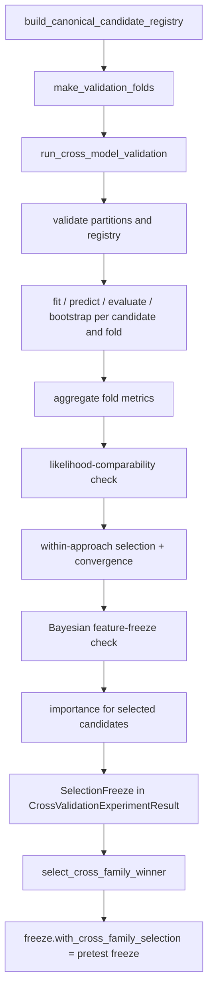

# Cross-Validation And Selection

> **The folds described here are the ones that run today.** How folds are
> produced is being replaced by the `splitting` package, documented in
> [Splitting](SPLITTING.md); the selection layer around them is unaffected.

This document describes how candidates are declared, fitted on fixed
training-only folds, reload-checked, summarized, and selected: first within
each approach, then across families, ending in the pretest freeze that the
final evaluation consumes. The whole layer is MLflow-free. Everything here is
derived from `src/age_group_prediction/experiment/contracts.py`,
`candidates.py`, `candidate_registry.py`, `runner.py`, `partitions.py`,
`artifacts.py`, `importance.py`, `aggregation.py`, `policies.py`,
`selection.py`, `evidence.py`, `final_selection.py`, `seeds.py`, and
`hashing.py`.

## 1. Workflow



Inside `run_cross_model_validation`, the partitions (see
[DATA_AND_SPLITTING.md](DATA_AND_SPLITTING.md#7-partition-checks-before-modeling))
and the candidate registry are validated **before any model factory is
called**. Candidates run in sorted ID order.

## 2. Candidate Contracts And The Canonical Registry

`CandidateDefinition` fields:

| Field | Meaning |
|---|---|
| `candidate_id`, `approach` | Identity; approach is one of the three model class names |
| `model_factory` | Zero-argument callable returning a fresh model; excluded from equality and descriptors |
| `fit_feature_spec`, `component_feature_specs` | Spec passed to `fit`; all component specs (the fit spec must be among them; components unique) |
| `metrics` | Metric tuple; keys `(name, target, aggregation_level)` must be unique |
| `configuration` | JSON-safe, frozen identity settings |
| `prediction_config` | Default `PredictionConfig()` |
| `selection_role` | `eligible` (default) or `diagnostic_comparator` (evaluated, never selected) |
| `importance_specs` | `PermutationImportanceSpec` tuple, default `()` |

`to_descriptor()` serializes everything except the factory.
`MetricReference(metric_name, target, aggregation_level="building")` names a
metric row (`MetricReference.from_metric(metric)` avoids drift).
`SelectionCriterion(name, metric_references, optimization_direction,
reduction="mean"|"sum")` reduces referenced aggregate means to one value, and
`SelectionPolicy(approach, criteria, likelihood_comparability)` orders them.

`build_canonical_candidate_registry(config) -> CandidateRegistry` returns
`candidates`, `selection_policies`, `final_refit_factories` (keys must equal
the candidate IDs), `candidate_set_name` (`CANDIDATE_SET_NAME =
"gate8-canonical-v1"`, module constant only), and `candidate_set_fingerprint`
(SHA-256 of canonical JSON of the ordered descriptors).
`candidate_by_id(candidate_id)` looks one up.

| Candidate | Approach | Fit feature spec | Configuration |
|---|---|---|---|
| `direct-poisson` | `DirectCohortModel` | `tree__ses_linear` | `family` from `[direct_cohort]` |
| `independent-nb2` | `IndependentTotalProbabilityModel` | `total_count__ses_linear` (+ `composition__ses_linear`) | `total_family` from `[independent_total_probability]` |
| `bayesian-reduced` | `BayesianConditionalModel` | same specs as `independent-nb2` | `profile` = configured `active_profile` |

Both conditional candidates force `include_pointwise_log_probabilities=True`.
Metric sets are listed in
[EVALUATION_AND_METRICS.md](EVALUATION_AND_METRICS.md#4-default-metric-sets-and-the-canonical-candidates).
The final-refit factories reuse the CV factories except for
`bayesian-reduced`, whose final factory forces `active_profile="full"`.

## 3. Running Cross-Validation

```text
run_cross_model_validation(
    outer_train_df, *, split_manifest, validation_folds, candidates,
    selection_policies, master_seed=None, experiment_config=None,
    evaluation_config=None, schema=DEFAULT_MODELING_SCHEMA,
    required_approaches=(all three), require_convergence=True,
    capture_artifacts=False,
) -> CrossValidationExperimentResult
```

### Master seed

An explicit `master_seed` wins (source `explicit_argument`); otherwise
`experiment_config.randomness.default_seed` is used (source
`experiment_config.randomness.default_seed`). Supplying neither, or a negative
seed, raises `ValueError`. `evaluation_config` falls back to
`experiment_config.evaluation`; with neither, no bootstrap runs.

### Registry validation

Before fitting, the runner requires the eligible candidates' approaches and
the policies' approaches to equal `required_approaches` exactly, requires each
approach's component set (`tree` for Model A; `total_count` and
`composition` for Models B and C), validates component specs against the schema and
importance specs against their components, and checks that each criterion
references declared metrics whose direction matches the criterion.

### Per-fold lifecycle

For each candidate and fold:

1. derive `fit`, `predict`, `evaluate`, and `bootstrap` seeds with purpose
   `candidate/{id}/fold/{i}/{operation}` (Section 10);
2. call the factory; a non-`BaseAgeGroupModel` raises `TypeError`;
3. `fit(fold.fit_df, feature_spec=fit_feature_spec, rng=...)`;
4. `predict(fold.validation_df, prediction_config=..., rng=...)` and require
   prediction IDs in validation-row order;
5. `evaluate_predictions`;
6. `neighborhood_cluster_bootstrap` with `default_seed` (not an rng), when an
   evaluation config exists;
7. read model metadata;
8. `capture_fold_artifact` when `capture_artifacts=True` (Section 4);
9. record `FoldRunEvidence(candidate_id, approach, fold_identity, prediction,
   evaluation, bootstrap, model_metadata, seeds)`.

### Nested tuning

The runner has no tuning step. Tuning happens inside each model's `fit` on
that fold's `fit_df`, using internal known-neighborhood folds and seeds drawn
from the fit generator, so validation rows never influence hyperparameters.
Model A and Model B tune with Optuna; the Bayesian model has fixed priors and
profiles. See [MODELING_GUIDE.md](MODELING_GUIDE.md#hyperparameter-tuning).

### Convergence

With `require_convergence=True` (the default), a candidate whose fold metadata
has a falsy `policy_passed` for any stage under `model_metadata["model"]["diagnostics"]`
is excluded from selection; if an approach has no remaining candidate,
`ValueError` is raised. This matters because the reduced Bayesian diagnostics
use `action = "warn"` and do not raise during `fit`.

### Failure context

Exceptions from `fit`, `predict`, `evaluate`, `bootstrap`, and
`capture_artifacts` are re-raised as `RuntimeError("Candidate '{id}' failed
during {operation} on fold {i}: {Type}: {message}")`, chained from the
original. Selection and importance errors are not wrapped.

### Result

`CrossValidationExperimentResult` fields: `fold_runs`, `fold_metrics_df`,
`aggregate_metrics_df`, `bootstrap_intervals_df`, `predictions_df`,
`calibration_df`, `importance_df`, `importance_summary_df`,
`fold_coverage_df`, `selections`, `freeze`, `provenance`, and `artifacts`
(default `()`). Data frames are deep-copied. Fitted models not selected are
dropped before importance is computed.

## 4. Fold Artifacts And Reload Checks

`capture_fold_artifact(model, validation_df, *, candidate_id, fold_index) ->
FoldArtifactEvidence(candidate_id, fold_index, state_bundle, reload_check)`:

1. export `model.to_state_bundle()`;
2. rebuild with `type(model).from_state_bundle(json.loads(json.dumps(bundle)))`
   and **no** `train_df`;
3. predict `validation_df` with both models under `PredictionConfig()` and
   `default_rng(0)`;
4. compute the maximum absolute difference in `total_mean`, `cohort_means`,
   `age_group_probabilities`, and parametric `dispersion`/`scale` (a family,
   target-set, or shape mismatch counts as infinity);
5. require every difference to be **exactly 0** (tolerance `0.0`), else raise
   `ValueError`.

`ReloadCheck(max_abs_differences, tolerance, passed)` serializes infinity as
`null`. The bundle must be JSON-serializable without NaN. Capturing artifacts
does not change any other result; MLflow logging requires them.

## 5. Aggregation, Bootstrap Evidence, And Fold Coverage

- **Aggregate metrics** group fold metrics by `candidate_id`, `approach`,
  `metric_name`, `target`, and `aggregation_level`, producing `mean`,
  `standard_deviation` (0 for one fold), and `fold_count`. Selection reads
  `mean`.
- **Bootstrap evidence** stacks two scopes. Fold rows (`scope="fold"`) are
  each fold's own interval, `interval_basis =
  "within_fold_neighborhood_cluster_bootstrap"`. Cross-validation rows
  (`fold_index=None`) average replicate $r$ across folds, take percentile
  bounds of those averages, use the aggregate mean as the point value, and
  are marked `interval_basis = "index_paired_replicate_mean_across_folds"`
  and `assumes_independent_folds=True`: each fold's replicate $r$ is an
  independent resample, and pairing them by index treats the folds as
  independent. The code treats fold-scope intervals as the primary evidence.
- **Fold coverage** lists every outer-training building with its
  `validation_fold_count`: 1 for non-singletons, 0 for singletons.

## 6. Validation-Only Permutation Importance

`PermutationImportanceSpec(component, metric, feature_blocks, repeats=5)`
with `FeatureBlock(name, columns)`. Blocks must be non-empty, columns unique
and within that component spec's numeric, categorical, or exposure columns,
and never identifiers, targets, or forbidden columns; the metric must
minimize or maximize.

For each **selected** candidate, fold, block, and repeat, the block's columns
are permuted together (one shared row order, seed purpose
`importance/{id}/fold/{i}/{component}/{block}/repeat/{r}`) in
`validation_df` only; the fitted model predicts again and the metric is
scored against the unpermuted targets. Degradation is signed by the metric
direction. The summary reports mean, standard deviation, count, and the
0.025/0.975 quantiles.

**The canonical registry declares no importance specs**, so a canonical run
has empty `importance_df` and `importance_summary_df`.

## 7. Within-Approach Selection

| Policy | Criteria (all minimize, in order) |
|---|---|
| `direct_cohort_selection_policy(cohort_names)` | `independent_cohort_joint_nll`: **sum** of per-cohort parametric `predictive_nll` (total excluded); `mean_cohort_rmse` |
| `sequential_joint_selection_policy(approach)` | `joint_predictive_nll`; `composition_log_loss`; `total_rmse` |

Eligible candidates are ranked lexicographically on the criteria (negated for
`maximize`), then by `candidate_id`. Before ranking, the
likelihood-comparability check refuses mixing discrete and continuous
families under a distributional criterion
([EVALUATION_AND_METRICS.md](EVALUATION_AND_METRICS.md#5-likelihood-comparability)).
After ranking, the **Bayesian feature-freeze check** requires the selected
Bayesian candidate's `total_count` and `composition` specs to equal the
selected Model B candidate's specs, or raises `ValueError`.

`FrozenApproachSelection(approach, selected_candidate_id,
rejected_candidate_ids, rejection_reasons, criterion_values, policy)`
requires exactly one reason per rejected candidate:

- `Ranked below '{selected}' under the declared ordered training-only
  selection criteria: {criterion} {value} versus {value} (margin ...)`, or a
  note that the candidates tied on every criterion and were ordered by ID;
- `Excluded by the convergence selection constraint: ...`.

With one candidate per approach, the canonical run rejects nothing.

## 8. The Selection Freeze

`SelectionFreeze` fields: `manifest_fingerprint`,
`outer_training_building_ids`, `fold_identities`, `candidate_descriptors`,
`selections`, `master_seed`, `master_seed_source`, `cross_family_selection`
(default `None`), and `test_metrics` (default `None`).

It moves one way through three states; each transition returns a new value
via `dataclasses.replace`:

| State | Created by | Refusals |
|---|---|---|
| CV freeze | `run_cross_model_validation` | constructor refuses test metrics without a decision |
| Pretest freeze | `with_cross_family_selection(decision)` | a second decision, a different manifest fingerprint, unknown candidate IDs |
| Finalized freeze | `with_test_metrics(summary)` | no decision, or test metrics already present |

`to_dict()` is the canonical serialization hashed by the final evaluation.

## 9. Cross-Family Selection And The Pretest Freeze

`select_cross_family_winner(cv_result) -> CrossFamilySelection` uses rule
`CROSS_FAMILY_RULE_NAME = "composition-first-lexicographic"`, version
`CROSS_FAMILY_RULE_VERSION = "1.0"`. It reads only `cv_result.selections`,
the freeze's candidate descriptors and manifest fingerprint, and
`aggregate_metrics_df`, and needs one selected winner per approach
(diagnostic comparators are ignored).

1. **Conditional stage.** Rank the Model B and Bayesian winners by
   `joint_predictive_nll` (target `joint`, building level), then candidate ID.
   `conditional_tie_break_used` is true when the values are equal.
2. **Final stage.** Compare the conditional winner with the Model A winner
   lexicographically on `composition_log_loss` (child level), mean cohort
   `rmse`, mean cohort `mae`, then `candidate_id`. Cohort references come from
   Model A's descriptor and exclude the total. `decisive_final_criterion` is
   the first criterion that differs; `final_tie_break_used` is true when none
   does.

**Why composition first.** Composition-first was chosen because age-group
probabilities are a primary estimand and because it gives a complete
deterministic answer when composition and cohort count accuracy disagree.
RMSE-first would subordinate that estimand. A Pareto rule can leave the
measured disagreement unresolved and would still need a fallback.

Every read must be a metric the candidate declared, with exactly one finite
aggregate row. Per-target `predictive_nll` is never read.

`CrossFamilySelection` records `rule` (`CrossFamilySelectionRule`: name,
version, conditional criterion, final criteria, reductions, comparability
text), `manifest_fingerprint`, `compared_candidate_ids`,
`candidate_approaches`, `criterion_metric_references`, `criterion_values`,
`conditional_winner_candidate_id`, `conditional_tie_break_used`,
`selected_candidate_id`, `selected_approach`, `decisive_final_criterion`, and
`final_tie_break_used`.

The **pretest freeze** is `cv_result.freeze.with_cross_family_selection(decision)`.
It has no holdout information; [FINAL_EVALUATION.md](FINAL_EVALUATION.md)
verifies it against a recomputed decision before the lockbox is opened.

## 10. Seeds, Hashes, And Provenance

- **Seeds.** `_stable_seed(master, purpose)` is the first four bytes of
  $\operatorname{SHA256}(\texttt{"\{master\}:\{purpose\}"})$ read as a
  big-endian unsigned integer. Purposes are `candidate/{id}/fold/{i}/{op}` in
  CV, `importance/...` for importance, and `final/{id}/{op}` in the final
  evaluation. Operations never share mutable random streams.
- **Hashes.** Manifest fingerprint and table/schema hashes
  ([DATA_AND_SPLITTING.md](DATA_AND_SPLITTING.md#4-splitmanifest)), fold
  identity fingerprints, feature-spec fingerprints, and the candidate-set
  fingerprint all use SHA-256 over canonical representations.
- **Provenance.** `ExperimentProvenance` records `training_data_hash`,
  `training_schema_hash`, `manifest_fingerprint`, `split_summary` (no IDs),
  `master_seed`, `master_seed_source`, `feature_spec_fingerprints`,
  `package_versions` (numpy, pandas, scipy, scikit-learn, lightgbm, optuna,
  torch, pyro-ppl), and `run_settings` (`building_id_column`,
  `evaluation_config`, `require_convergence`, `required_approaches`,
  `capture_artifacts`, `fold_count`).

## 11. Configuration

| TOML section / field | Canonical value | Effect |
|---|---|---|
| `[randomness] default_seed` | 42 | Master seed when none is passed |
| `[folds] n_folds` | 5 | Outer CV folds (notebook) and Model B tuning folds |
| `[evaluation]` | 200 replicates, 0.95 | Fold bootstraps ([details](EVALUATION_AND_METRICS.md#8-configuration)) |
| `[tuning] n_trials` | 30 | Optuna trials inside Model A and Model B fits |
| `[direct_cohort] family`, `[independent_total_probability] total_family` | candidate identity | Recorded in candidate configuration |
| `[bayesian_conditional] active_profile` | `reduced` | CV profile; the final factory forces `full` |
| `[bayesian_reduced_diagnostics] action` | `warn` | Why `require_convergence` matters |

## 12. Pitfalls

- **Use the registry.** Do not rebuild candidates in a notebook or change a
  CV factory without its final-refit counterpart.
- **Feature forms and families are candidate identities**, not
  hyperparameters; compare them as separate candidates on the same folds.
- **Keep `require_convergence=True`.** Reduced Bayesian fits warn rather than
  raise.
- **Prefer fold-scope intervals.** The cross-validation band assumes
  independent folds.
- **Importance is empty canonically.** Add `importance_specs` to a candidate
  to compute it.
- **The pretest freeze is created once.** A second
  `with_cross_family_selection` is refused; rerun cross-validation instead.
- **Stale comments.** `experiment/partitions.py` and `experiment/aggregation.py`
  call the folds "repeated overlapping splits"; each building validates once.

## 13. Tests And Related Documents

- Tests: `tests/unit/test_experiment.py` (runner, partitions, selection,
  comparability, convergence, importance, bootstrap evidence, seeds),
  `tests/unit/test_experiment_artifacts.py` (reload checks, failure context,
  provenance), `tests/unit/test_final_selection.py` (cross-family rule and
  freeze transitions), and `tests/validation/test_experiment_real_models.py`.
- [MODELING_GUIDE.md](MODELING_GUIDE.md) Sections 8–11,
  [DATA_AND_SPLITTING.md](DATA_AND_SPLITTING.md),
  [EVALUATION_AND_METRICS.md](EVALUATION_AND_METRICS.md),
  [FINAL_EVALUATION.md](FINAL_EVALUATION.md),
  [MLFLOW_EXPERIMENTS_GUIDE.md](MLFLOW_EXPERIMENTS_GUIDE.md#5-understand-the-cv-run-layout).
