# Modeling Guide

This guide describes the supported building-level modeling workflow. The
statistical details of the Bayesian model live in
[BAYESIAN_CONDITIONAL_MODEL.md](BAYESIAN_CONDITIONAL_MODEL.md); this guide
focuses on how the pipeline fits together and which contracts callers must
preserve.

```mermaid
flowchart LR
    A[Simulator output] --> B[Modeling table]
    B --> C[Persisted outer split]
    C --> D[Training-only folds]
    D --> E[Candidate registry]
    E --> F[Cross-validation]
    F --> G[Within-approach freeze]
    G --> H[Cross-family decision]
    H --> I[Pretest freeze]
    I --> J[Guarded full refit and one-time lockbox evaluation]
    J --> K[State bundles and MLflow pyfunc models]
```



The default runtime configuration is [configs/modeling.toml](../configs/modeling.toml).
Load it with:

```python
from age_group_prediction import load_experiment_config

config = load_experiment_config("configs/modeling.toml")
```

The loader refuses unknown sections and keys, and every top-level section and
Bayesian subsection must be present. Within most other sections, a missing
key falls back to its dataclass default (for example `[outer_split]`
`test_fraction = 0.2`), so keep `configs/modeling.toml` complete rather than
relying on omission.

## 1. Generate The Population

**Purpose.** `student_simulator` owns synthetic data generation; the modeling
package consumes its final building-level table without changing simulator
behavior.

```python
from student_simulator import StudentPopulationSimulator, load_simulation_config

simulation_config = load_simulation_config("configs/simulation.toml")
simulator = StudentPopulationSimulator(simulation_config)
source_df = simulator.run()
```

The output has one row per building. It includes identifiers, prediction-time
features, room counts, and the targets `n_kindergarten`, `n_elementary`,
`n_highschool`, and `n_children_total`. The simulator configuration is
controlled by [configs/simulation.toml](../configs/simulation.toml), not
`modeling.toml`.

**Guarantees and pitfalls.** Treat simulator internals and latent random
effects as data-generation details, not model features. The canonical modeling
schema explicitly rejects `u_b`, `w_j`, and `v_b` as predictors.

## 2. Build The Modeling Table

**Purpose.** `build_modeling_table` selects and orders the canonical columns,
derives room shares, and validates the complete table.

```python
from age_group_prediction import DEFAULT_MODELING_SCHEMA, build_modeling_table

modeling_table = build_modeling_table(
    source_df,
    schema=DEFAULT_MODELING_SCHEMA,
)
```

The public input is a `pandas.DataFrame`; the output is a new DataFrame with:

| Role | Columns |
|---|---|
| IDs | `building_id`, `neighborhood_id` |
| Numeric features | `ses`, `avg_household_size`, `median_age`, `n_daycares_500m`, `n_apartments`, `3_rooms_share`, `4_rooms_share`, `5_rooms_share` |
| Categorical feature | `school_status` |
| Cohort targets | `n_kindergarten`, `n_elementary`, `n_highschool` |
| Total target | `n_children_total` |

`ModelingSchema` is the typed control. Room shares are derived from raw room
counts divided by `n_apartments`; `6_rooms` is the reference and is not emitted
as a share. IDs must be unique, exposure must be positive, numeric values must
be finite, targets must be nonnegative integers, and cohort targets must sum
exactly to the total. Do not bypass this builder with a hand-assembled table.

Details: [DATA_AND_SPLITTING.md](DATA_AND_SPLITTING.md#2-the-modeling-table).

## 3. Create And Preserve The Outer Split

**Purpose.** The outer split represents the deployment claim "new building in
a known neighborhood" and creates the lockbox held out from all selection.

```python
import numpy as np

from age_group_prediction import split_known_neighborhood_buildings

split = split_known_neighborhood_buildings(
    modeling_table,
    config=config.outer_split,
    rng=np.random.default_rng(config.randomness.default_seed),
)
outer_train_df = split.train_df
```

The result is a `DataSplit(train_df, test_df, manifest)`. The immutable
`SplitManifest` records sorted training and holdout building IDs, source-table
and schema hashes, row and neighborhood counts, requested and realized holdout
fractions, strategy version, seed source, and deployment claim.

Production uses `persist_split_manifest`, `load_split_manifest`, and
`replay_split_manifest`. Persistence is write-once: an existing unequal
manifest is refused. Replay verifies the table and schema hashes, the strategy
version, row and neighborhood counts, the exact ID partition, and the realized
fraction before materializing the split; it does not check the seed source,
requested fraction, or deployment claim. Never generate a replacement split
after results exist. The `[outer_split]` TOML section controls the fraction,
ID columns, and strategy.

Every non-singleton neighborhood contributes at least one holdout building and
retains at least one training building; singleton neighborhoods remain wholly
in training. Each neighborhood holds out `round(size * test_fraction)`
buildings (Python's half-to-even rounding), clamped to that range, so the
realized holdout fraction can differ from the requested fraction in either
direction; small neighborhoods push it up, and singletons pull it down.

Details: [DATA_AND_SPLITTING.md](DATA_AND_SPLITTING.md#3-outer-split-algorithm).

## 4. Build Training-Only Validation Folds

**Purpose.** `make_validation_folds` rotates buildings within neighborhoods so
model selection never reads the outer holdout.

```python
from age_group_prediction import make_validation_folds

fold_plan = make_validation_folds(
    outer_train_df,
    config=config.folds,
    rng=np.random.default_rng(config.randomness.default_seed),
)
```

`FoldPlan.folds` contains immutable `ValidationFold` values with `fold_index`,
`fit_df`, and `validation_df`. `unvalidated_building_ids` names singleton
buildings that train but cannot be validated without violating the known-
neighborhood claim. `[folds].n_folds` must be at least two; there is no separate
validation fraction because each eligible building validates once and the
share is determined by fold rotation.

Details: [DATA_AND_SPLITTING.md](DATA_AND_SPLITTING.md#6-training-only-validation-folds).

## 5. Declare And Fit Features

**Purpose.** `FeatureSpec` declares a component's raw columns and transformations;
`FittedFeatureTransformer` learns preprocessing on the fit partition only.

```python
from age_group_prediction import (
    DEFAULT_PROBABILITY_FEATURE_SPEC,
    DEFAULT_TOTAL_FEATURE_SPEC,
    DEFAULT_TREE_FEATURE_SPEC,
    FittedFeatureTransformer,
)

transformer = FittedFeatureTransformer(DEFAULT_TOTAL_FEATURE_SPEC)
fit_features = transformer.fit_transform(fit_df)
validation_features = transformer.transform(validation_df)
```

Feature specs control component (`tree`, `total_count`, or `age_probability`),
numeric and categorical columns, SES and daycare forms, interactions, scaling,
exposure, unknown-category policy, and spline knots. The experiment helpers
`FeatureSpecCandidate` and `enumerate_feature_specs` are available from
`age_group_prediction.experiment`. See
[FEATURE_ENGINEERING.md](FEATURE_ENGINEERING.md) for every spec field,
validation rule, transformation step, output column, and candidate form.

The transformer learns scaling and spline state from the fit partition only;
one-hot category levels come from the schema, not from the data.
Unknown categories fail by default; `treat_as_reference` must be an explicit
choice. Raw room counts and derived room shares cannot be mixed, targets and
latent columns are forbidden, and `n_apartments` is an offset for total-count
specifications rather than an ordinary predictor.

## 6. Use The Shared Model Contract

**Purpose.** All three families implement `BaseAgeGroupModel`:

- `DirectCohortModel`: one LightGBM regressor per cohort under a Poisson, NB2,
  or Normal family ([DIRECT_COHORT_MODEL.md](DIRECT_COHORT_MODEL.md)).
- `IndependentTotalProbabilityModel`: NB2 or Poisson total plus calibrated
  age-probability models
  ([INDEPENDENT_TOTAL_PROBABILITY_MODEL.md](INDEPENDENT_TOTAL_PROBABILITY_MODEL.md)).
- `BayesianConditionalModel`: Bayesian NB2 total plus conditional
  Dirichlet-multinomial composition
  ([overview](BAYESIAN_CONDITIONAL_MODEL_OVERVIEW.md); full guide:
  [BAYESIAN_CONDITIONAL_MODEL.md](BAYESIAN_CONDITIONAL_MODEL.md)).

```python
import numpy as np

from age_group_prediction import DirectCohortModel, PredictionConfig

model = DirectCohortModel().fit(
    train_df,
    feature_spec=DEFAULT_TREE_FEATURE_SPEC,
    rng=np.random.default_rng(42),
)
prediction = model.predict(
    evaluation_df,
    prediction_config=PredictionConfig(),
    rng=np.random.default_rng(43),
)
```

`fit` returns the model; `predict` returns `PredictionResult`; and
`evaluate(eval_df, metrics=..., rng=...)` returns `EvaluationResult` without
refitting. `PredictionResult` contains building IDs, total and cohort means,
age-group probabilities, reconciliation error, and optional draws, intervals,
pointwise log probabilities, and parametric distributions.

The result validates dimensions, finite nonnegative means, probabilities that
sum to one, and cohort means that reconcile to the total. `[prediction]`,
`[prediction_validation]`, and each family-specific TOML section control the
runtime. See [BAYESIAN_CONDITIONAL_MODEL.md](BAYESIAN_CONDITIONAL_MODEL.md) for
Bayesian priors, profiles, diagnostics, tensor shapes, and inference cautions.

## 7. Evaluate Comparable Quantities

**Purpose.** Metrics consume the shared prediction contract. The evaluation
layer never fits a model.

```python
from age_group_prediction import (
    MeanAbsoluteError,
    evaluate_predictions,
    neighborhood_cluster_bootstrap,
)

metrics = (MeanAbsoluteError(target="n_kindergarten"),)
evaluation = evaluate_predictions(observed_df, prediction, metrics)
bootstrap = neighborhood_cluster_bootstrap(
    observed_df,
    prediction,
    metrics,
    config=config.evaluation,
    default_seed=42,
)
```

`EvaluationResult.metrics_df` uses the stable columns `metric_name`, `value`,
`aggregation_level`, `sample_count`, and `target`. The bootstrap resamples
whole neighborhoods and returns point evaluation, percentile intervals,
replicate metrics, failure count, and metadata. `[evaluation]` controls
replicates, confidence level, the cluster column, failure tolerance, the
Poisson deviance floor, and PIT histogram bins; every key is required.

Metrics declare required prediction capabilities. Missing capabilities fail by
default. Do not compare per-target `predictive_nll` across approaches:
direct-cohort values are marginal, while conditional approaches expose a
sequential decomposition. Only the two conditional approaches share the
`joint_predictive_nll` object used by cross-family selection.

Details: [EVALUATION_AND_METRICS.md](EVALUATION_AND_METRICS.md).

## 8. Build The Candidate Registry

**Purpose.** The registry is the canonical declaration of candidates,
selection policies, and final-refit factories.

```python
from age_group_prediction.experiment import build_canonical_candidate_registry

registry = build_canonical_candidate_registry(config)
```

The registry contains `direct-poisson`, `independent-nb2`, and
`bayesian-reduced`, their policies, and a fingerprint of their descriptors.
Each `CandidateDefinition` records its ID, approach, factory, fit and component
feature specs, metrics, JSON-safe configuration, prediction settings, selection
role, and optional importance specifications. Its callable factory is omitted
from the serialized descriptor.

The Bayesian CV factory uses the configured reduced profile; its final-refit
factory is forced to the full profile. Do not reproduce registry wiring in a
notebook or change one side of the CV/final factory pairing independently.

Details: [CROSS_VALIDATION_AND_SELECTION.md](CROSS_VALIDATION_AND_SELECTION.md#2-candidate-contracts-and-the-canonical-registry).

## 9. Run Cross-Validation

**Purpose.** `run_cross_model_validation` fits every candidate on fixed folds,
evaluates validation predictions, applies selection policies, and returns
immutable evidence.

```python
from age_group_prediction.experiment import run_cross_model_validation

cv_result = run_cross_model_validation(
    outer_train_df,
    split_manifest=split.manifest,
    validation_folds=fold_plan.folds,
    candidates=registry.candidates,
    selection_policies=registry.selection_policies,
    experiment_config=config,
    capture_artifacts=True,
)
```

The result includes fold and aggregate metrics, bootstrap intervals,
predictions, calibration, permutation importance (empty for the canonical
registry, which declares no importance specs), fold coverage, selections,
the freeze, provenance, and optional fold artifacts. With
`capture_artifacts=True`, every candidate/fold state bundle is reloaded and
required to reproduce point predictions exactly; MLflow logging requires this
evidence.

### Hyperparameter Tuning

Hyperparameters are tuned **inside** each model's `fit`, so tuning is nested:
every cross-validation fold's fit rows get their own inner, training-only
known-neighborhood folds and their own studies, and the validation fold never
influences the chosen values. The full-training refit (Section 12) tunes again
on the complete training partition.

| Model | What is tuned | Objective | Inner folds |
|---|---|---|---|
| `DirectCohortModel` | One study per cohort over LightGBM capacity and regularization, plus NB2 dispersion | Mean held-out NLL (Poisson/NB2) or RMSE (Normal) | `DirectCohortConfig.tuning_folds` (package default 5; not set by the TOML) |
| `IndependentTotalProbabilityModel` | Total L2 penalty and multinomial `C` in two separate studies; the temperature is then fitted, not tuned | Held-out total NLL; held-out child-weighted composition NLL | `[folds]` from `configs/modeling.toml` |
| `BayesianConditionalModel` | Nothing: priors and NUTS profiles are fixed configuration | — | — |

All studies go through `run_optuna_study` (`tuning.py`). It uses a seeded TPE
sampler with a purpose-derived seed, `[tuning] n_trials` (30), and `n_jobs=1`;
a timeout is refused because it would break reproducibility. Pruning
(`enable_pruning`, off by default) uses a median pruner. Only **completed**
trials can be selected, ties break on trial number, and a study with no
completed trial raises. Search-space bounds live in
`[direct_cohort_search_space]` and
`[independent_total_probability_search_space]`.

Feature forms, count families, and model families are **not**
hyperparameters. They are separate candidates compared on identical folds.
Tuning evidence is kept in model metadata (`diagnostics["tuning"]` and
`diagnostics["search_space"]`). MLflow logs it as `tuning/{component}/best_value`
metrics and `tuning/fold_{i}/{component}_trials.csv` tables, where the
components are each cohort for Model A and `total`/`probability` for Model B.
Details per model: [DIRECT_COHORT_MODEL.md](DIRECT_COHORT_MODEL.md#3-fitting)
and
[INDEPENDENT_TOTAL_PROBABILITY_MODEL.md](INDEPENDENT_TOTAL_PROBABILITY_MODEL.md#5-fitting-procedure).

An explicit `master_seed` takes precedence over
`experiment_config.randomness.default_seed`; omitting both is an error.
`require_convergence=True` excludes candidates that report a failed diagnostic
policy. Before fitting, partition validation rejects holdout leakage, training
IDs that differ from the manifest, duplicate fold indices, and folds whose fit
and validation IDs overlap or do not partition the outer training IDs exactly;
it also validates the training table, requires at least one fold, and requires
fold rows to equal the canonical training rows.

Details: [CROSS_VALIDATION_AND_SELECTION.md](CROSS_VALIDATION_AND_SELECTION.md#3-running-cross-validation).

## 10. Read The Within-Approach Freeze

**Purpose.** Cross-validation selects one candidate independently within each
approach before any cross-family comparison.

`cv_result.selections` contains `FrozenApproachSelection` records. Each record
names the approach, selected and rejected candidate IDs, one rejection reason
per rejected candidate, criterion values, and the policy. The same records are
embedded in `cv_result.freeze`, along with fold identities, candidate
descriptors, manifest fingerprint, outer-training IDs, and seed provenance.

`direct_cohort_selection_policy(...)` ranks direct candidates by the summed
independent per-cohort parametric predictive NLL (excluding the total, to
avoid double counting), then by mean cohort RMSE. `sequential_joint_selection_policy(...)` ranks
conditional candidates by `joint_predictive_nll`, then composition log loss,
then total RMSE. A freeze is immutable; transitions return a new value.

Details: [CROSS_VALIDATION_AND_SELECTION.md](CROSS_VALIDATION_AND_SELECTION.md#7-within-approach-selection).

## 11. Select Across Families

**Purpose.** `select_cross_family_winner` chooses one overall winner using only
the already-frozen CV evidence.

```python
from age_group_prediction.experiment import select_cross_family_winner

decision = select_cross_family_winner(cv_result)
pretest_freeze = cv_result.freeze.with_cross_family_selection(decision)
```

Rule version `1.0`, `composition-first-lexicographic`, first compares the two
conditional winners by minimum `joint_predictive_nll`. It then compares that
winner with the direct-cohort winner by composition log loss, mean cohort RMSE,
mean cohort MAE, and finally candidate ID. The decision records every compared
value and tie break. It cannot read or accept test evidence.

Calling `with_cross_family_selection` twice, using a foreign manifest, or
referencing an unknown candidate is refused.

Details: [CROSS_VALIDATION_AND_SELECTION.md](CROSS_VALIDATION_AND_SELECTION.md#9-cross-family-selection-and-the-pretest-freeze).

## 12. Refit And Evaluate Once

**Purpose.** Finalization refits all three approach winners on all outer
training data and evaluates them once on the replayed lockbox; the selected
cross-family winner is reported alongside predeclared comparators.

The experiment package exposes the lower-level
`refit_frozen_approach_winners` and `evaluate_frozen_models_on_lockbox`
functions for tested composition. Operational callers should use the single
guarded `age_group_prediction.tracking.run_final_evaluation` entry point used
by the notebook. It verifies the pretest freeze, fingerprints the exact refit
attempt, opens a linked top-level MLflow run, records the freeze while the
lock is still `locked`, changes it to `opened`, replays the manifest, evaluates,
and logs the result.

The refit calls each winner's `fit` on the full training partition, so Model A
and Model B re-run their hyperparameter tuning there with seeds derived from
the frozen master seed. The Bayesian winner has no tuning; its final factory
switches to the full NUTS profile. The `final_attempt_fingerprint` hashes the
refits' seeds and configuration, so a retry that would tune differently is
refused.

There is intentionally no runnable final-evaluation example here. Opening the
canonical lockbox is an irreversible project action, not a tutorial step. A
complete prior final run is refused even if deleted. After any opened attempt,
only an identical retry with the same source CV run, decision, refit/scoring
fingerprint, and manifest is allowed.

Details: [FINAL_EVALUATION.md](FINAL_EVALUATION.md).

## 13. Save And Serve State Bundles

**Purpose.** Every fitted model supports JSON-safe persistence without pickle.

```python
bundle = model.to_state_bundle()
reloaded = type(model).from_state_bundle(bundle)
reloaded_prediction = reloaded.predict(evaluation_df)
```

Bundle format `2` stores the model class and implementation version, schema,
default seed, fitted transformer, training hashes, dependency versions, and
model-specific state. It stores no training rows. Header, class, and
implementation-version mismatches are refused.

Point prediction needs only the bundle. The direct and independent models need
the hash-matching `train_df` argument to restore bootstrap draws or intervals;
the Bayesian posterior is self-contained. Final MLflow models wrap the same
bundle as a models-from-code pyfunc whose input is a raw modeling frame
without targets (expected, not enforced by the pyfunc) and whose output is
`building_id`, `total_mean`, and each cohort's `{cohort}_mean` and
`{cohort}_probability` columns.

Details: [FINAL_EVALUATION.md](FINAL_EVALUATION.md#9-pyfunc-serving-contract).

## 14. Preserve Seeds And Hashes

**Purpose.** Reproducibility is explicit evidence, not an ambient process
setting.

The project default seed is 42. Split APIs accept NumPy generators; the outer
split records whether the caller supplied one, while folds record no seed
source and are identified by fingerprints instead. Cross-validation requires either
`master_seed` or `ExperimentConfig`; it derives stable purpose-specific seeds
from the master seed, candidate ID, fold index, and operation. Fit, predict,
evaluate, and bootstrap therefore do not share mutable random streams.

Manifests, feature specs, candidate sets, training tables, schemas, decisions,
and final attempts use canonical JSON or table hashes. A matching seed is not
enough when any hashed input differs. Preserve provenance objects and logged
artifacts with the results they explain.

Details: [CROSS_VALIDATION_AND_SELECTION.md](CROSS_VALIDATION_AND_SELECTION.md#10-seeds-hashes-and-provenance)
and [DATA_AND_SPLITTING.md](DATA_AND_SPLITTING.md#4-splitmanifest).

## 15. Use The Notebook As A Thin Client

[notebooks/02_model_fitting.py](../notebooks/02_model_fitting.py) orchestrates
the package APIs and displays evidence; it does not implement model logic.
Running it as a plain Python script performs setup only: it loads the persisted
`artifacts/lockbox/split_manifest.json` (creating it if absent) and replays it
in memory to obtain the training partition, but never displays or evaluates a
holdout row. Interactive execution requires an explicit **Run cross-validation**
button. Final evaluation requires both the confirmation checkbox **I understand
this opens the one-time test holdout and cannot be undone for this manifest.**
and **Run final evaluation (opens lockbox)**.

To open it, follow
[Run The Modeling Notebook](../README.md#run-the-modeling-notebook) in the
README.

Use the notebook for the canonical research workflow and package APIs for
automation. Do not call model-specific fit/predict methods from new notebook
cells, reconstruct candidates by hand, read the holdout before the pretest
freeze, or add an unguarded final-evaluation path.

For tracking setup, run layout, search examples, model loading, and failure
semantics, continue with
[MLFLOW_EXPERIMENTS_GUIDE.md](MLFLOW_EXPERIMENTS_GUIDE.md).