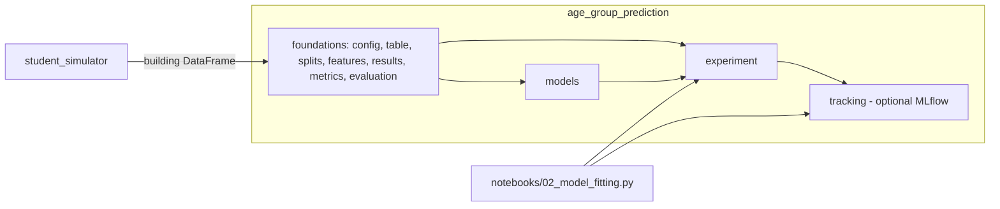

# Module Reference

One entry per Python module in `src/`: what it owns, its main public API, what
it depends on inside the project, and where to read more. Names come from the
code as of 2026-09-24. A module's own docstring, when present, is the most
detailed and current description.

Modules or names starting with `_` are internal: they can change without
notice. Import public names from a package root (`age_group_prediction`,
`age_group_prediction.models`, `age_group_prediction.modeling`,
`age_group_prediction.hyperparameter_tuning`, `age_group_prediction.experiment`,
`age_group_prediction.tracking`, `student_simulator`).

## How The Packages Fit Together

- `student_simulator` never imports `age_group_prediction`.
- `experiment/` and `models/` never import MLflow; only `tracking/` does.
- `tracking/` adapts finished experiment evidence and holds no statistical
  logic.

## `student_simulator` — Synthetic Population

Specification: [SIMPLIFIED_MODEL_PLAN.md](SIMPLIFIED_MODEL_PLAN.md). These
modules have no module docstrings; their classes and functions do.

| Module | Responsibility | Main public API | Depends on |
|---|---|---|---|
| `__init__.py` | Public package surface (27 names) | Re-exports the classes and functions below | All modules below |
| `config.py` | Strict, immutable generation settings loaded from `configs/simulation.toml`; test-only thresholds from `configs/validation.toml` | `load_simulation_config`, `load_validation_config`, `Config`, `SimulationSettings`, `NeighborhoodSettings`, `BuildingSettings`, `RoomMixSettings`, `TotalChildrenSettings`, `CohortSettings`, `TransformSettings`, `ValidationSettings`, `ConfigError` | — |
| `features.py` | Shared feature transforms used by generation | `scale_household_size`, `scale_median_age`, `center_rooms`, `daycare_saturation`, `positive_part`, `positive_part_interaction`, `normalize_positive_weights`, `stable_row_normalize`, `expected_room_probabilities` | — |
| `neighborhood.py` | One row of public context per neighborhood | `NeighborhoodSimulator.generate(n_neighborhoods, rng)` | `config` |
| `building.py` | Buildings per neighborhood with apartment room composition | `BuildingSimulator.generate(neighborhoods, rng)` | `config`, `features` |
| `apartment.py` | Apartment rows, context joins, and long cohort views | `ApartmentSimulator.generate`, `.with_context`, `.to_cohort_long` | `config` |
| `outcomes.py` | Apartment child totals (NB2) and their three-cohort split | `TotalChildrenSimulator`, `CohortCompositionSimulator` | `config`, `features` |
| `pipeline.py` | One full run with a shared RNG; final building table | `StudentPopulationSimulator(config).run(rng)`, `.last_result`, `SimulationResult` | `neighborhood`, `building`, `apartment`, `outcomes`, `config` |

## `age_group_prediction` — Foundations

Workflow guide: [MODELING_GUIDE.md](MODELING_GUIDE.md). The package root
re-exports 101 public names from these modules and `models`/`experiment`; it
does not import `tracking`.

| Module | Responsibility | Main public API | Depends on | Read more |
|---|---|---|---|---|
| `modeling_config.py` | Typed, immutable schema, column constants, feature specs, and all model/evaluation/tuning configs with invariant checks | `ModelingSchema`, `DEFAULT_MODELING_SCHEMA`, `FeatureSpec`, `CategoricalFeatureSpec`, `OuterSplitConfig`, `FoldConfig`, `RandomnessConfig`, `DEFAULT_OUTER_SPLIT_CONFIG`, `DEFAULT_FOLD_CONFIG`, `PredictionConfig`, `PredictionValidationConfig`, `EvaluationConfig`, `OptunaTuningConfig`, `DirectCohortConfig`, `IndependentTotalProbabilityConfig`, `BayesianConditionalConfig`, `NUTSProfileConfig`, `DEFAULT_*_FEATURE_SPEC`, column constants | — | Guide §2, §5 |
| `experiment_config.py` | Load `configs/modeling.toml` into one `ExperimentConfig` (unknown keys refused) | `load_experiment_config`, `ExperimentConfig` | `modeling_config` | Guide intro |
| `dataset_builder.py` | Build and validate the canonical modeling table, including room shares | `build_modeling_table` | `modeling_config` | [Data and splitting](DATA_AND_SPLITTING.md#2-the-modeling-table); guide §2 |
| `data_splitting.py` | Known-neighborhood outer split, write-once manifest, replay, training-only folds | `split_known_neighborhood_buildings`, `SplitManifest`, `DataSplit`, `persist_split_manifest`, `load_split_manifest`, `replay_split_manifest`, `make_validation_folds`, `FoldPlan`, `ValidationFold`, `SeedSource` | `hashing`, `modeling_config` | [Data and splitting](DATA_AND_SPLITTING.md); guide §3-4 |
| `splitting/splitters.py` | The three split methods; each pairs a train/test split with its cross-validator. Replaces `data_splitting.py`, not yet wired | `Splitter`, `Method`, `DesignMatrix`, `Target`, `Groups` | `splitting.stratified` | [Splitting](SPLITTING.md) |
| `splitting/stratified.py` | The two splitters scikit-learn does not provide: split within every group, keeping each on both sides | `StratifiedHoldout`, `StratifiedFolds` | — (numpy, scikit-learn only) | [Splitting §3](SPLITTING.md#3-what-stratified_by_group-guarantees) |
| `utils.py` | Helpers shared across packages: table type aliases and positional row selection | `take_rows`, `DesignMatrix`, `Target`, `Groups`, `Exposure` | — | — |
| `scoring.py` | A named scoring function of `(y_true, y_pred)` with its direction, and three ready-made ones; shared by `modeling` and `hyperparameter_tuning`. Not the root-level `Metric` protocol from `metrics.py` | `Metric`, `POISSON_DEVIANCE`, `RMSE`, `MAE` | — (numpy, scikit-learn only) | [Direct cohort model §0.2](DIRECT_COHORT_MODEL.md#02-api) |
| `hashing.py` | Stable content hashes for tables and column schemas | `table_hash`, `column_schema_hash` | — | [Data and splitting §4](DATA_AND_SPLITTING.md#4-splitmanifest); guide §14 |
| `fitted_features.py` | Fold-fitted scaling, splines, schema-driven one-hot encoding, exposure offset, and state export. Was `feature_engineering.py`; the models still use it, and it is slated for removal | `FittedFeatureTransformer` | `modeling_config`, `state_bundle` | [Feature engineering](FEATURE_ENGINEERING.md); guide §5 |
| `feature_engineering/transforms.py` | The vocabulary of typed transformations, each a frozen model carrying only its own parameters | `Standardize`, `Center`, `Quadratic`, `Log`, `Log1p`, `DomainScale`, `DomainMinMax`, `RelativeSaturation`, `OneHot`, `Transform` | — (pydantic, pandas, numpy, scikit-learn only) | [Feature transformations §8](FEATURE_TRANSFORMATIONS.md) |
| `feature_engineering/transformer.py` | Declaring a design matrix and fitting it: named column plans, products of transformed columns, and the exposure offset | `ColumnPlan`, `Interaction`, `FeatureTransformer` | — (pydantic, pandas, numpy, scikit-learn only) | [Feature transformations §8](FEATURE_TRANSFORMATIONS.md) |
| `preprocessing.py` | Row-wise preprocessing that learns nothing: count columns to shares, with an optional omitted reference | `ShareTransformer` | — (numpy, pandas, scikit-learn only) | [Feature transformations §8.0](FEATURE_TRANSFORMATIONS.md#80-shared-column-groups) |
| `hyperparameter_tuning/parameters.py` | The values each hyperparameter may take, one class per Optuna `suggest_*` call, validated when created | `Parameter`, `FloatParameter`, `IntParameter`, `CategoricalParameter` | `hyperparameter_tuning._config` (optuna, pydantic) | [Hyperparameter tuning plan](HYPERPARAMETER_TUNING_PLAN.md) |
| `hyperparameter_tuning/evaluator.py` | Score one Optuna trial: set its parameters, then for every CV fold fit a `FeatureTransformer` and a `BaseAgeGroupModel` on the training rows and score the validation rows with a `Metric`; combine the fold scores | `CVHyperparameterEvaluator` | `utils`, `feature_engineering`, `modeling`, `scoring`, `hyperparameter_tuning.parameters`, `hyperparameter_tuning.aggregation` | [Hyperparameter tuning plan §4.2](HYPERPARAMETER_TUNING_PLAN.md) |
| `hyperparameter_tuning/aggregation.py` | Combine a trial's fold scores into its value: `aggregate(scores, fold_sizes)`, with the size-weighted mean (default), the plain mean, or a lower bound using the K-fold corrected standard error | `Aggregation`, `WeightedMean`, `Mean`, `LowerBound`, `corrected_std_error` | `hyperparameter_tuning._config` (numpy, pydantic) | [Hyperparameter tuning plan §4.2.1](HYPERPARAMETER_TUNING_PLAN.md) |
| `results.py` | Validated, model-independent prediction and evaluation contracts | `PredictionResult`, `EvaluationResult`, `ParametricDistributionSpec` | `modeling_config` | [Evaluation and metrics §1](EVALUATION_AND_METRICS.md#1-the-prediction-contract); guide §6 |
| `metrics.py` | Metric protocol and classes: point, likelihood, composition, reconciliation, interval, and PIT metrics; capability checks | `Metric`, `MetricResult`, `MeanAbsoluteError`, `RootMeanSquaredError`, `MeanBias`, `R2`, `MeanPoissonDeviance`, `ParametricPredictiveNegativeLogLikelihood`, `PointwisePredictiveNegativeLogLikelihood`, `JointPredictiveNegativeLogLikelihood`, `CompositionLogLoss`, `CompositionBrierScore`, `ReconciliationError`, `IntervalCoverage`, `MeanIntervalWidth`, `WeightedIntervalScore`, `PredictiveNegativeLogLikelihood` and `RandomizedPIT` (abstract bases), `ParametricRandomizedPIT`, `DrawsRandomizedPIT`, `default_metric_set`, `available_prediction_capabilities` | `distributions`, `results`, `modeling_config` | [Evaluation and metrics](EVALUATION_AND_METRICS.md); guide §7; plan §9 |
| `evaluation.py` | Evaluate fixed predictions and neighborhood-cluster bootstrap intervals; never fits models | `evaluate_predictions`, `neighborhood_cluster_bootstrap`, `BootstrapEvaluationResult`, `MissingCapabilityPolicy` | `metrics`, `resampling`, `results`, `modeling_config` | [Evaluation and metrics §6-7](EVALUATION_AND_METRICS.md#7-neighborhood-cluster-bootstrap); guide §7 |
| `distributions.py` | NB2 parameter mappings, pointwise log mass (log density for Normal), draws, multinomial and Dirichlet-multinomial prefix log masses | `nb2_scipy_parameters`, `nb2_torch_parameters`, `pointwise_log_probability`, `draw_outcomes`, `dirichlet_multinomial_prefix_log_masses`, `multinomial_prefix_log_masses` | — | [Bayesian guide](BAYESIAN_CONDITIONAL_MODEL.md#pointwise-posterior-log-probabilities) |
| `predictive.py` | Central prediction intervals from predictive draws, shared by all models | `central_prediction_intervals` | — | — |
| `resampling.py` | Neighborhood-cluster row-index resampling for bootstraps | `NeighborhoodClusterResampler` | — | [Evaluation and metrics §7](EVALUATION_AND_METRICS.md#7-neighborhood-cluster-bootstrap) |
| `tuning.py` | Deterministic Optuna studies over completed trials | `run_optuna_study`, `TuningResult`, `TrialRecord` | `modeling_config` | — |
| `state_bundle.py` | JSON state-bundle format and checks shared by all models | `STATE_BUNDLE_FORMAT`, `check_bundle_header`, `verify_training_frame`, `restore_config`, `restore_feature_spec`, `dependency_versions` | `hashing`, `modeling_config` | Guide §13; README "Saving And Reloading" |

## `age_group_prediction.modeling` — Rebuilt Models (Not Yet Wired)

These are scikit-learn-style models that replace `models/` and
`modeling_config`: settings in the constructor, and `fit(X, y, exposure=None)` /
`predict(X, exposure=None)` on an already transformed design matrix. Nothing in `experiment/` or
`tracking/` calls them yet; the old `models/` is deleted once all three models
are rebuilt. Plan: [MODEL_REIMPLEMENTATION_PLAN.md](MODEL_REIMPLEMENTATION_PLAN.md).

| Module | Responsibility | Main public API | Depends on |
|---|---|---|---|
| `__init__.py` | Public surface of the rebuilt models | `BaseAgeGroupModel`, `DirectCohortModel`, `Objective` | `base`, `direct_cohort` |
| `base.py` | The shared contract: abstract `fit` and `predict`, and `evaluate(y_true, y_pred, metric)`; `get_params`/`set_params`/`clone` come from scikit-learn's `BaseEstimator` | `BaseAgeGroupModel` | `scoring` (top level) |
| `direct_cohort.py` | **Model A, rebuilt.** One LightGBM regressor for one cohort with fixed hyperparameters; `poisson` or `regression`; optional exposure offset | `DirectCohortModel`, `Objective` | `base` |

Model description: [DIRECT_COHORT_MODEL.md §0](DIRECT_COHORT_MODEL.md#0-the-rebuilt-model-modelingdirect_cohortpy).

## `age_group_prediction.models` — Model Families

Being replaced by `modeling` (above). Model descriptions: [DIRECT_COHORT_MODEL.md](DIRECT_COHORT_MODEL.md),
[INDEPENDENT_TOTAL_PROBABILITY_MODEL.md](INDEPENDENT_TOTAL_PROBABILITY_MODEL.md),
[BAYESIAN_CONDITIONAL_MODEL_OVERVIEW.md](BAYESIAN_CONDITIONAL_MODEL_OVERVIEW.md),
and the full [BAYESIAN_CONDITIONAL_MODEL.md](BAYESIAN_CONDITIONAL_MODEL.md);
overview: guide §6. `models/__init__.py` imports the LightGBM model before the
torch model to avoid a native-runtime crash when reloading boosters.

| Module | Responsibility | Main public API | Depends on |
|---|---|---|---|
| `__init__.py` | Public model surface | `BaseAgeGroupModel`, `DirectCohortModel`, `IndependentTotalProbabilityModel`, `BayesianConditionalModel`, `PredictionResult`, `EvaluationResult`, `ParametricDistributionSpec` | `base`, the three models, `results` |
| `base.py` | Shared lifecycle: `fit`/`predict`/`evaluate`, fitted preprocessing, training hashes, metadata, state bundles | `BaseAgeGroupModel` (`fit`, `predict`, `evaluate`, `to_state_bundle`, `from_state_bundle`, `configuration_record`) | `fitted_features`, `evaluation`, `metrics`, `results`, `hashing`, `state_bundle` |
| `direct_cohort.py` | **Model A.** One tuned LightGBM regressor per cohort (Normal, Poisson, or NB2 family); marginal log probabilities; bootstrap-refit draws | `DirectCohortModel` | `base`, `tuning`, `distributions`, `resampling`, `predictive`, `data_splitting` |
| `independent_total_probability.py` | **Model B.** NB2 (or Poisson) total plus grouped multinomial age probabilities with evidence-gated temperature calibration; sequential-joint log probabilities; bootstrap refits | `IndependentTotalProbabilityModel` | `base`, `count_regression`, `grouped_multinomial`, `probability_calibration`, `fold_scoring`, `tuning`, `distributions`, `resampling` |
| `count_regression.py` | Internal: Poisson/NB2 total regression fit, mean prediction, state | — | `modeling_config` |
| `grouped_multinomial.py` | Internal: weighted grouped multinomial rows (no child expansion), fit, logits, state | — | `modeling_config` |
| `probability_calibration.py` | Internal: composition loss kernels and temperature calibration | — | `metrics`, `modeling_config` |
| `fold_scoring.py` | Internal: held-out fold losses used during Model B tuning | — | `count_regression`, `grouped_multinomial`, `probability_calibration`, `fitted_features`, `distributions` |
| `bayesian_conditional.py` | **Model C (Bayesian).** Hierarchical NB2 total plus Dirichlet-multinomial composition: lifecycle, diagnostic policy, exactly reconciled posterior prediction | `BayesianConditionalModel` | `base`, `bayesian_components`, `bayesian_inference`, `distributions`, `predictive` |
| `bayesian_components.py` | Pyro total and composition model definitions; prior-predictive simulation | `PriorPredictiveSummary` | `modeling_config` |
| `bayesian_inference.py` | Sequential NUTS execution, sampler instrumentation, convergence diagnostics | `evaluate_stage_diagnostics` | `modeling_config` |

Bayesian deep dive: [BAYESIAN_CONDITIONAL_MODEL.md](BAYESIAN_CONDITIONAL_MODEL.md).

## `age_group_prediction.experiment` — Cross-Validation And Selection

MLflow-free workflow from fixed folds to the one-time final evaluation. Guide
§8-12. Component documents:
[cross-validation and selection](CROSS_VALIDATION_AND_SELECTION.md),
[final evaluation](FINAL_EVALUATION.md), and, for `partitions.py`,
[data and splitting](DATA_AND_SPLITTING.md#7-partition-checks-before-modeling).

| Module | Responsibility | Main public API | Depends on |
|---|---|---|---|
| `__init__.py` | Public experiment surface (31 names) | See the entries below | All public modules below |
| `contracts.py` | Immutable declarations of candidates, metrics references, and selection policies | `CandidateDefinition`, `SelectionPolicy`, `SelectionCriterion`, `MetricReference`, `FeatureBlock`, `PermutationImportanceSpec`, `FoldIdentity` | `models.base`, `metrics` |
| `candidates.py` | Ordered, predeclared candidate feature specifications | `enumerate_feature_specs`, `FeatureSpecCandidate` | `modeling_config` |
| `candidate_registry.py` | The canonical candidates (`direct-poisson`, `independent-nb2`, `bayesian-reduced`), policies, and CV/final-refit factories | `build_canonical_candidate_registry`, `CandidateRegistry` | the three models, `contracts`, `policies`, `candidates`, `experiment_config` |
| `policies.py` | Approach-specific selection policies | `direct_cohort_selection_policy`, `sequential_joint_selection_policy` | `contracts`, `metrics` |
| `partitions.py` | Validate that folds contain only outer-training rows; alignment and coverage checks | `validate_experiment_partitions` | `data_splitting`, `contracts`, `results` |
| `runner.py` | Fit, predict, and evaluate every candidate on fixed folds; select; freeze | `run_cross_model_validation` | `partitions`, `evidence`, `selection`, `aggregation`, `importance`, `artifacts`, `seeds`, `models.base` |
| `evidence.py` | Fold, selection, freeze, provenance, and CV result records; one-way freeze transitions | `CrossValidationExperimentResult`, `SelectionFreeze`, `FrozenApproachSelection`, `FoldRunEvidence`, `ExperimentProvenance` | `artifacts`, `contracts`, `final_selection` (type hints only), `evaluation`, `hashing`, `state_bundle` |
| `selection.py` | Internal: within-approach selection and likelihood-comparability checks | — | `contracts`, `evidence` |
| `aggregation.py` | Internal: fold-metric aggregation, bootstrap evidence, importance summaries | — | `modeling_config` |
| `importance.py` | Internal: validation-only repeated permutation importance | — | `contracts`, `evidence`, `partitions`, `seeds` |
| `seeds.py` | Internal: purpose-scoped child seeds from one master seed | — | — |
| `artifacts.py` | Capture each fold's state bundle and prove it reloads exactly | `capture_fold_artifact`, `FoldArtifactEvidence`, `ReloadCheck` | `models.base`, `results` |
| `final_selection.py` | Deterministic cross-family decision from CV evidence only | `select_cross_family_winner`, `CrossFamilySelection`, `CrossFamilySelectionRule` | `contracts`, `evidence` |
| `final_evaluation.py` | Full-training refit and one-time lockbox evaluation building blocks; pretest-freeze verification and attempt fingerprint | `refit_frozen_approach_winners`, `evaluate_frozen_models_on_lockbox`, `verify_pretest_freeze`, `final_attempt_fingerprint`, `FinalEvaluationResult` | `evidence`, `final_selection`, `partitions`, `artifacts`, `seeds`, `data_splitting`, `models.base` |

Operational callers should not call `final_evaluation` functions directly; use
the guarded `tracking.run_final_evaluation`. `capture_fold_artifact`,
`verify_pretest_freeze`, and `final_attempt_fingerprint` are public in their
modules but not re-exported from `age_group_prediction.experiment`; import them
from the module path.

## `age_group_prediction.tracking` — Optional MLflow Adapter

Requires `uv sync --group tracking`. Guide:
[MLFLOW_EXPERIMENTS_GUIDE.md](MLFLOW_EXPERIMENTS_GUIDE.md). The package
docstring describes the run layout in detail. The final path is described in
[FINAL_EVALUATION.md](FINAL_EVALUATION.md). `AgeGroupPyfuncModel` and
`prediction_to_frame` are imported from
`age_group_prediction.tracking.pyfunc_model`, not the package root.

| Module | Responsibility | Main public API | Depends on |
|---|---|---|---|
| `__init__.py` | Public tracking surface (16 names) | See the entries below | `settings`, `runs`, `evidence`, `final` |
| `settings.py` | Resolve tracking URI, experiment name, and artifact location from the environment | `resolve_tracking_settings`, `TrackingSettings`, `DEFAULT_TRACKING_URI`, `DEFAULT_EXPERIMENT_NAME`, `ARTIFACT_LOCATION_ENV` | — |
| `runs.py` | Run lifecycle: caller context, comparison and final parents, failure endings, experiment-location refusal, duplicate/retry guards | `TrackingContext`, `tracked_comparison`, `tracked_final_evaluation`, `ComparisonRunHandle`, `FinalRunHandle`, `EVIDENCE_COMPLETE_TAG`, `FINAL_RUN_ROLE` | `settings`, `_files` |
| `evidence.py` | Log a finished CV comparison: preflight checks, parent evidence, children | `log_experiment_result`, `log_cross_validation_experiment` | `runs`, `candidates`, `experiment` |
| `candidates.py` | Internal: one nested child run per candidate | — | `runs`, `experiment` |
| `final.py` | The single guarded final path and its logging | `run_final_evaluation`, `log_final_evaluation_result` | `runs`, `experiment.final_evaluation`, `candidates` |
| `pyfunc_model.py` | Models-from-code pyfunc that serves a refit from its state bundle | `AgeGroupPyfuncModel`, `prediction_to_frame` | the three models, `state_bundle`, `results` |
| `_files.py`, `_metadata.py` | Internal: param/JSON/CSV writers and metadata readers | — | — |

## Other Code Locations

| Location | Role | Read more |
|---|---|---|
| `notebooks/01_eda.py` | EDA client | [README](../README.md#run-the-modeling-notebook) (opened the same way as the modeling notebook) |
| `notebooks/02_model_fitting.py` | Thin, button-gated modeling client | [README](../README.md#run-the-modeling-notebook); guide §15 |
| `configs/simulation.toml`, `configs/modeling.toml`, `configs/validation.toml` | Simulator, modeling/experiment, and test-only threshold settings | Guide §1 and intro |
| `tests/unit`, `tests/validation`, `tests/characterization` | Focused contracts; recovery and real-model checks; simulator and notebook behavior | README "Run The Tests" |
